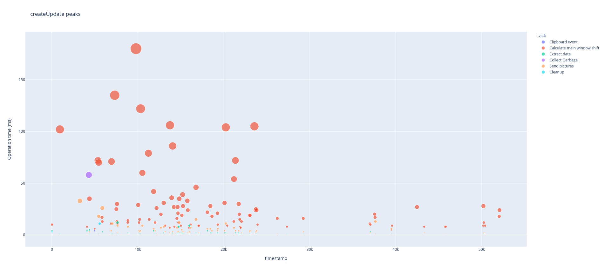

# Projector stats report generator
This is a complementary set of scripts to generate graphs and metric reports on JetBrains Projector.

### Quick start
* Clone the `stats` branch of [this Projector fork](https://github.com/muldrik/projector-server). Clone this project to
the same parent folder (example: `home/projector-server`, `home/statReports`)
* Run the app any number of times for 60 seconds: it will affect stabilize the average stats
* In this project, run `metricsTableMarkdown.py` to generate markdown tables for various metrics in the project.
* run `plots.py` to generate plots for the last run. They include memory and network usage, as well as scatter plots
of operations that took unusually long time to complete. The plots will open automatically in your browser

### Example table
Create Update Thread
====================

|Name|Params|Measurement Unit|Value|Standard deviation|
| :---: | :---: | :---: | :---: | :---: |
|Average|minTime=0, minObj=0|ms|1.0|0.0|
|Average|minTime=0, minObj=1|ms|1.0|0.0|
|Peak rate|minTime=0, minObj=0|millis / second|110.3|2.4|
|Peak rate|minTime=3, minObj=0|millis / second|87.0|1.6|
|Peak rate|minTime=5, minObj=0|millis / second|80.7|2.5|
|Peak rate|minTime=10, minObj=0|millis / second|67.0|3.3|
|Peak rate|minTime=20, minObj=0|millis / second|54.3|4.2|
|Peak rate|minTime=3, minObj=2|millis / second|28.7|2.5|
|Peak rate|minTime=5, minObj=2|millis / second|27.3|2.9|
|Peak rate|minTime=3, minObj=3|millis / second|15.0|2.4|
|Peak rate|minTime=5, minObj=3|millis / second|14.0|2.4|
|Power punishing rate|minTime=3, minObj=0|(ms)^1.2 / second|177.7|5.3|
|Power punishing rate|minTime=5, minObj=0|(ms)^1.2 / second|169.0|6.2|
|Power punishing rate|minTime=5, minObj=0|(ms)^1.5 / second|559.3|22.9|
|Power punishing rate|minTime=5, minObj=0|(ms)^2.0 / second|5047.7|190.9|

### Example plot

